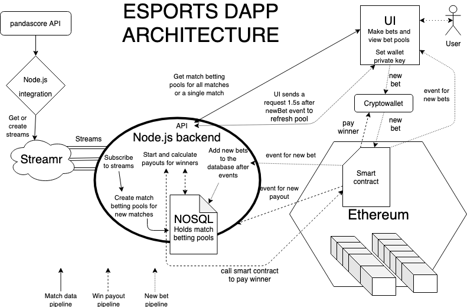

# Esports Dapp Node.js backend

* Backend needs to know the ethereum url and the smart contracts address in the .env file
* IT IS VERY IMPORTANT THAT YOU THE SMART CONTRACT AND THE WALLET THAT SIGNS THE PAYOUTS HAVE THE SAME ADDRESS
    * This enables easy ETH flow
    * The smart contracts could also be reworked to do this automatically
* Backend listens to the streams created by the integration tool
    * Needs to know the stream keys at .env
        * Attach atleast the streams for not_started matches and finished matches of the same videogame
            * Backend does not support any functions for running matches at this point.
    * Backend does not need to know which video game’s data is being streamed
    * Currently it’s required to set up a new backend instance for each videogame.
        * All video game streams could be listened to by the same backend if the streams are differentiated by video game in .env
        * Then you would need to set up the REST API to function for different games
        * The smart contracts would most likely not need any modifications as bets have their own independent ids
* Backend stores the data of not_started matches in an in-memory NOSQL database
    * Frontend gets match data through this database.
        * This database could be replaced by Streamr streams to allow easy real time changes in the frontend
* When a new not_started match arrives at the backend it sends a function call to the smart contract to set the closing timestamp for match betting.
    * Not_started matches database basically works as a betting pool.
        * All matches have a json array containing data of all the bets made for the match
* When a match is finished, the backend checks the in-memory database for the match_id of the new finished match
    * if a match betting pool is found and a winner is set to the finished match then payouts are started 
* When payouts are initiated the bet pools values are calculated, and winning bets are filtered 
    * total:
        * A value of all the bets combined
        * __This pool could be taxed to make profits__
    * winners:
        * All winning bets
        * if bet.team_id = match.winner_id 
    * winning-pool:
        * Value of all winning bets combined
* After values are calculated, the winning bet pool gets mapped so that for each bet a payout function call is sent to the smart contract
    * Win = total * (bet.value / winning-pool)
        * This is the payout formula. This means that the winners share the total pot based on the their bet’s ratio to the winning pool
    * The smart contract then transfers the wing to the winning better
        * An event is emitted after a successful transfer with the win value and winner address.
            * This is simply logged in the backend as a receipt
    * When payouts are completed the data of the finished match is saved to a database document for finished matches
        * This way there is a backup for the bets of a match in case something goes wrong
            * Still in-memory though
    * Next the match is removed from the not_started database document
* The backend also provides a REST API to get data of matches and bets for the frontend
    * GET /upcoming 
        * For data of all matches without betting pools
    * GET /upcoming/:match_id
        * For data of a match and it’s betting pool

Contents of .env file:

STREAMR_API_KEY = {Your streamr API key}

CSGO_UPCOMING_MATCHES_STREAM_ID = {stream_id}

CSGO_RUNNING_MATCHES_STREAM_ID = {stream_id}

CSGO_FINISHED_MATCHES_STREAM_ID = {stream_id}

DOTA2_UPCOMING_MATCHES_STREAM_ID = {stream_id}

DOTA2_RUNNING_MATCHES_STREAM_ID = {stream_id}

DOTA2_FINISHED_MATCHES_STREAM_ID = {stream_id}

LOL_UPCOMING_MATCHES_STREAM_ID = {stream_id}

LOL_RUNNING_MATCHES_STREAM_ID = {stream_id}

LOL_FINISHED_MATCHES_STREAM_ID = {stream_id}

OW_UPCOMING_MATCHES_STREAM_ID = {stream_id}

OW_RUNNING_MATCHES_STREAM_ID = {stream_id}

OW_FINISHED_MATCHES_STREAM_ID = {stream_id}

BETFACTORY_ADDRESS = {Smart contract's address}

METAMASK_PRIVATE_KEY = {wallet private key for payouts}

VIDEOGAME={csgo, dota2, lol, ow}

[Frontend]()
[Streamr integration]()
[Smart contracts]()

### There is no running example of the DApp due to the gambling laws in Finland!