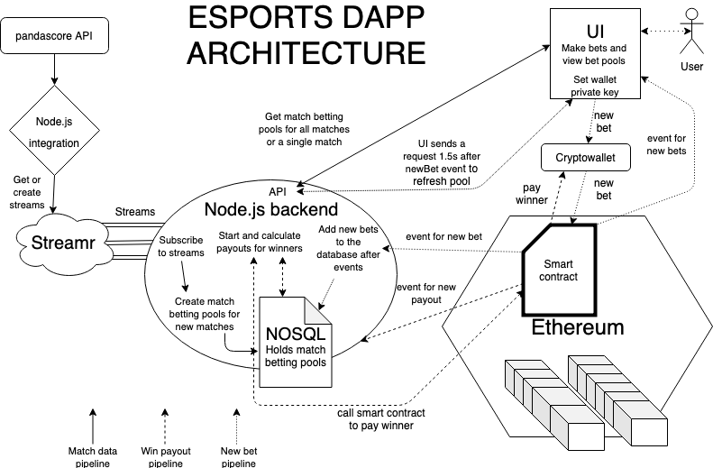

# Smart contract
* To deploy locally you need to run ie. Etherlime Ganache as a block simulator:
    * 'etherlime ganache' on command line
* Then compile and launch the smart contract
    * etherlime compile
    * etherlime deploy
        * The logged result field is the address to be used for the centralized backend and frontend to connect to the smart contract
* The smart contracts should be deployed to ethereum before launching backend
    * Backend sends all new matches found in streams to the smrt contracts to add closing timestamps
* Currently there is no way to recover bet data to the backend if the backend crashes
    * This means that backend reboots lose data of the bets in backends in-memory database.
        * This is one example of an issue that could be fixed by using Streamr to collect data of the bets.
        * Using any storage database would work just fine aswell
    * Some bet data is saved in the smart contracts so recovery tools could also be handled through ethereum.
* Smart contracts contain data of a bet’s owner
* Smart contracts also make sure that bets cannot be made to a match after 5 minutes before scheduled match start.
* Smart contracts hold an array of bet structs with values
    * uint betValue;
    * uint team_id;
    * uint match_id;
        * All of this data could very well be used to set recoveries for backend.
        * There are some issues with the indexing of arrays in solidity, so removing bets from the array could scramble the betId -> address mapping, and keeping all bets in the array would bloat the array.
    * With the backend currently handling most of the bet functionalities the bet struct is somewhat redundant
* Smart contracts are mostly responsible for new bet transactions and bet win payout transactions.
    * The payout is calculated in the node.js backend as solidity does not support floats
    * Events are emitted when these functions are completed.
        * The node.js backend gets the data of the new bets in the event
    * As most heavy operations are done in the Node.js backend a lot of gas is saved in the long run
* Payouts should be assigned so that only the owner of the app can deploy the function calls.
    * If non-owner users call the function with a valid betId the value that they send will be transfered to the bets owner.

[Frontend]()
[Streamr integration]()
[Centralized backend]()

### There is no running example of the DApp due to the gambling laws in Finland!