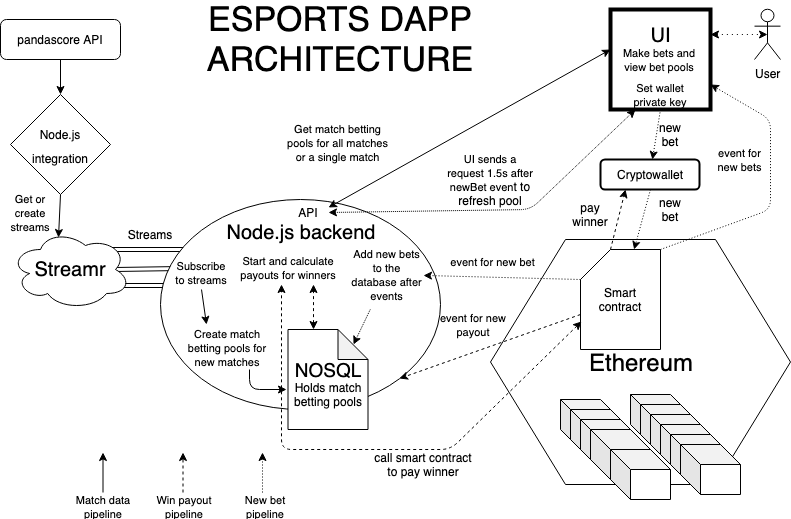

# React frontend for the esports DApp

* The frontend currently is unable to connect to a browser plugin wallet ie. MetaMask. 
    * Instead you need to enter your wallet's private key to make bets
* The frontend lists all not_started matches.
    * Simple data for all matches is accessed from the backend via REST API.
        * GET /upcoming
    * The frontend currently only displays matches that are upcoming or not yet finished.
        * Betting pools that have been closed for new bets are still displayed, so the betting pool values can still be seen
        * After backend removes the match from it’s not_started database document the match data will no longer be sent to the frontend
            * A page that displays finished matches and their betting pools could be created if a REST API for finished matches is created in the backend
* All matches are displayed as a button on the site
    * When the button is clicked a popup appears.
        * This is where you make your bets
        * Popup data is called from the API
            * GET /upcoming/:match_id
* Betting inside the popup is simple
    * Type in your bet value in wei
    * Select the team you are betting for
    * Send the bet
* The betting popup also displays information of the total value of the pool
    * Pools for both teams are also displayed (team1pool + team2pool = total)
    * When a new bet is added to the pool the popup sends a new GET request to the backend to refresh pool information
        * This is done by a blockchain event listener
            * To relieve some of the spaghetti code, more functionalities should be moved to the smart contract
            * As mentioned before, the match pools could also be sent to Streamr. If the pools would be implemented like this then the popups could just listen to a stream that contains the bets

# .env

REACT_APP_BACKEND_BASEURL = {DApp centralized backend url}

REACT_APP_BETFACTORY_ADDRESS = {smart contract's address}

REACT_APP_ETH_URL = {Ethereum url}

# Architecture

[Centralized backend]()
[Streamr integration]()
[Smart contracts]()

### There is no running example of the DApp due to the gambling laws in Finland!