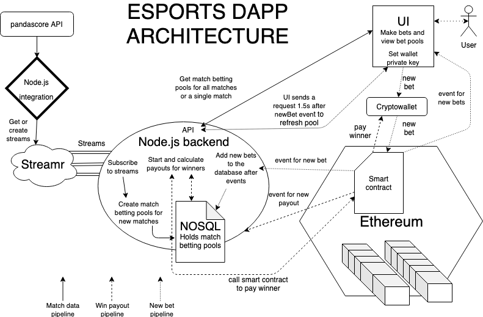

# Streamr integration tool for esports beeting DApp
* Esports API datamined: https://pandascore.co
    * Maximum 1000 API calls per hour
        * Current 4 second tick rate uses 900
* Currently only getting match data, So no singular game data supported in the Dapp
    * Free tier API only gets static match data.
        * By purchasing a new tier you can get more data from the API
        * Possibility for live game betting: first kill, first hit, last man standing etc.
            * Gaining access to this real time data would make for a more suitable use case for Streamr
            * Websocket access!
        * Get betting odds straight from the API
            * Current DApp implementation does not use odds
            * Odds could also be created by collecting and analysed static data 
                * Some expertise in the esports field would be required to avoid allowing bad odds
* Streamr integration .env allows changing the video game path.
    * Get data from the API as:
        * "https://api.pandascore.co/" + `${config.videogame}/matches`
    * Cs:go, DOTA2, LoL, Overwatch are supported by Pandascore.
        * Streamr streams are created with name:
            * “config.videogame + "__" + status”
            * This way all video games get to have their streams running simultaneously, and are easy to find in the editor
* All integrations for different video games should be deployed as separate instances
    * Also different Pandascore accounts for each video game (or a single purchased plan account that allows 4000 API calls per hour)
* The integration currently filters the data received from pandascore API before publishing it to the stream
    * This means that more data fields are available to be used for the Dapp, more info: 
        * https://developers.pandascore.co/doc/

# .env

STREAMR_API_KEY = {YOUR_STREAMR_API_KEY}

PANDASCORE_TOKEN = {YOUR_PANDASCORE_API_TOKEN}

VIDEOGAME = {csgo, dota2, lol, ow}

# Architecture

[Centralized backend](../esports-back)

[Frontend](../esports-frontend)

[Smart contracts](../esports-ethereum)

### There is no running example of the DApp due to the gambling laws in Finland!